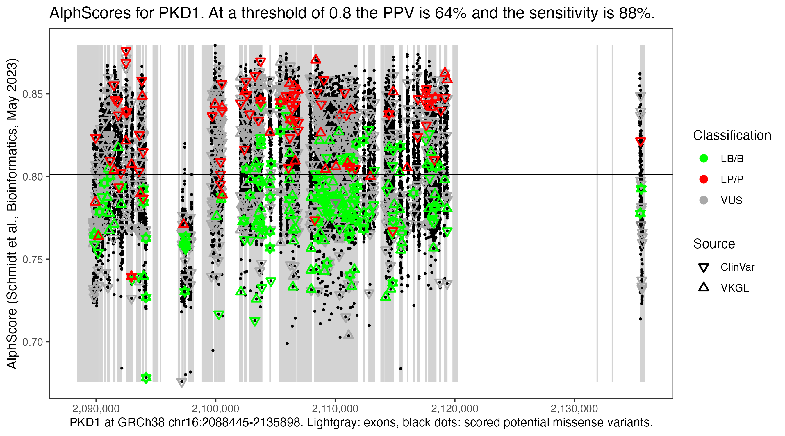

# alphscore-gene-plots

Plot AlphaFold2-based pathogenicity prediction scores for a particular gene and suggest a gene-specific threshold for separating pathogenic from benign variants.
An example:

More examples can be found in the [plots](plots) folder. These figures rely on data from the following brilliant resources to whom all credits are due:

### AlphScore
* __Predicting the pathogenicity of missense variants using features derived from AlphaFold2__.
Axel Schmidt, Sebastian Röner, Karola Mai, Hannah Klinkhammer, Martin Kircher, Kerstin U. Ludwig.
_Bioinformatics_, Volume 39, Issue 5, May 2023.
https://doi.org/10.1093/bioinformatics/btad280

### ClinVar
* __ClinVar: improvements to accessing data__.
  Melissa J. Landrum, Shanmuga Chitipiralla, Garth R. Brown, Chao Chen, Baoshan Gu, Jennifer Hart, Douglas Hoffman, Wonhee Jang, Kuljeet Kaur, Chunlei Liu, Vitaly Lyoshin, Zenith Maddipatla, Rama Maiti, Joseph Mitchell, Nuala O’Leary, George R. Riley, Wenyao Shi, George Zhou, Valerie Schneider, Donna Maglott, J. Bradley Holmes, Brandi L. Kattman.
  _Nucleic Acids Research_, Volume 48, Issue D1, 08 January 2020, Pages D835–D844.
  https://doi.org/10.1093/nar/gkz972

### VKGL
* __Dutch genome diagnostic laboratories accelerated and improved variant interpretation and increased accuracy by sharing data__.
  Ivo F. A. C. Fokkema, K. Joeri van der Velde, Mariska K. Slofstra, Claudia A. L. Ruivenkamp, Maartje J. Vogel, Rolph Pfundt, Marinus J. Blok, Ronald H. Lekanne Deprez, Quinten Waisfisz, Kristin M. Abbott, Richard J. Sinke, Rubayte Rahman, Isaäc J. Nijman, Bart de Koning, Gert Thijs, Nienke Wieskamp, Ruben J. G. Moritz, Bart Charbon, Jasper J. Saris, Johan T. den Dunnen, Jeroen F. J. Laros, Morris A. Swertz, Marielle E. van Gijn.
  _Human Mutation_, 40(12), 2230-2238.
  https://doi.org/10.1002/humu.23896

### toprdata
* ___topr_: an R package for viewing and annotating genetic association results__.
  Thorhildur Juliusdottir.
  _BMC Bioinformatics_, 24, 268 (2023).
  https://doi.org/10.1186/s12859-023-05301-4
